# DesafioTrademaster

API desenvolvida para o desafio Trademaster, focada em gerenciamento de recursos e operações RESTful.

## Contexto Funcional

Esta API é parte de uma plataforma de e-commerce que gerencia eventos assíncronos (como pedidos, pagamentos e atualizações de estoque) e processamento em lote (como relatórios diários). O sistema combina:

- Comunicação assíncrona via RabbitMQ para tarefas em tempo real.

- Processamento em lote para operações pesadas ou agendadas.

- PostgreSQL como banco de dados transacional.

Cenários de Uso:

- Um pedido é criado → dispara mensagem para atualizar estoque (RabbitMQ).

- Retentativas automáticas em falhas de conexão com serviços externos.



---

## Design Patterns Utilizados

1. Publisher/Subscriber (PubSub)
Onde: Comunicação entre serviços via RabbitMQ.

Objetivo: Desacoplar produtores (ex: API) de consumidores (ex: serviço de estoque).

2. Queue Worker
Onde: Processamento assíncrono de tarefas pesadas.

Objetivo: Distribuir carga e garantir resiliência (com retry e DLQ).

---

## Requisitos

- **Node.js:** >= 16.9.0  
- **NPM:** >= 7.x

---

## Instalação

1. Clone o repositório:
   ```sh
   git clone https://github.com/seu-usuario/DesafioTrademaster.git
   cd DesafioTrademaster

2. Instale as dependências:
   ```sh
   npm install

3. Crie um arquivo .env com as seguintes variáveis 
   
 **RabbitMQ** 
RABBITMQ_URL=
RABBITMQ_CONFIG_RECONNECT=
RABBITMQ_CONFIG_BACKOFF_STRATEGY=
RABBITMQ_CONFIG_BACKOFF_TIME=
RABBITMQ_CONFIG_EXPONENTIAL_LIMIT=
RABBITMQ_CONFIG_RECONNECT_ATTEMPTS=

 **PostgreSQL**
POSTGRES_HOST=
POSTGRES_PORT=
POSTGRES_USER=
POSTGRES_PASSWORD=
POSTGRES_DB=

 **API**
PORT=

## Rotas da API

1. GET / 
Descrição: Rota de teste para verificar se a API está online.

1. POST /orders
Descrição: Envia mensagens para a fila de mensageria.

## Estrutura de Pastas

   ```text
 ├── /src
 │   ├── /producers   # Publicadores de eventos
 │   ├── /consumers   # Consumidores (Workers)
 │   ├── /services    # Lógica de negócios
 │   ├── /batch       # Jobs de processamento em lote
 │   ├── /config      # Configurações do RabbitMQ
 │   ├── /utils       # Logs, Retry, etc.
 │   ├── app.js       # Entrypoint da API
 ├── /tests
 │   ├── producer.test.js
 │   ├── consumer.test.js
 ├── Dockerfile
 ├── docker-compose.yml
 ├── .env
 ├── package.json